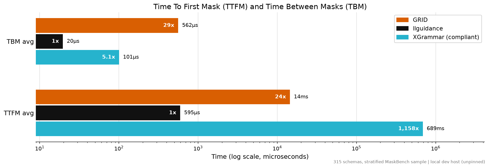

# GRID — Grammar-Railed Decoding (v0.0.7)

Grammar-constrained decoding engine for LLM code generation (SQL-first), built for
enterprise CRUD/RBAC settings: per-role and per-schema grammars, provable
soundness/completeness/termination guarantees, near-linear guard-rail cost over
growing decode windows, a replayable per-token audit trail, and checker-guided
repair of the residual (provably mask-unenforceable) failure class.

## Design lineage

| Version | What |
|---|---|
| **v0.0.5** - July 2023 | an early, partial design snapshot: precomputed token-sequence validity table over a pushdown automaton, decode-time logit masking |
| **v0.0.6** - September 2023| The first planned revision of the snapshot — already outperformed guidance (its July-2023 release) on the scaling benchmarks of that era |
| **v0.0.7** - November 2023| The research program's result, reached by planned iteration: viable-prefix masks keyed on parser *configurations* instead of token sequences (a full sequence-keyed table scales combinatorially), acceptance semantics replaced by prefix-viability (acceptance leaves the step-1 mask empty), plus the byte-level token↔terminal bridge, Rust kernels, the write-back cache, RBAC/schema projections, the audit chain, and SemanticChecker-guided repair — each step test- and benchmark-validated. v0.0.7 is the line the final patent application followed; the work has kept improving since. |

The design drew inspiration from published work (notably the Outlines paper);
GRID's design and implementation are our own throughout.

## Documents

| File | Purpose |
|---|---|
| [`GUARDRAIL-REDESIGN.md`](GUARDRAIL-REDESIGN.md) | The *why*: the v0.0.5→v0.0.7 design evolution — what changed and what was kept, chosen methods with proofs and source-checked numbers, cost model, benchmark rationale |
| [`DESIGN.md`](DESIGN.md) | The *what/how* of v0.0.7: modules, entity catalog with state machines, per-token hot path, error taxonomy, testing strategy, verification gates G0–G10, milestones M0–M6 |
| [`LESSONS.md`](LESSONS.md) | The v0.0.5→v0.0.7 record: what changed, why, with what measured result, and what we did next |
| [`ONBOARDING.md`](ONBOARDING.md) | Researcher onboarding: guided tour, formal design, competitive analysis |
| `bench/RESULTS*.md` | Benchmark reports (XGrammar, llguidance, Outlines, guidance across eras; MaskBench; Spider EX) |

## Interfaces

Public interfaces follow the `Guide` / logits-processor / tokenizer protocol shapes
used across our internal generation tools, vendored in `grid/protocols.py` with
conformance tests under `tests/protocols/`. Guides emit `Write`/`Generate`
instructions with tensor-typed token sets; processors apply hard masks in place.

## Quick start

```python
import grid
from grid import generate, samplers
from grid.policy.bundle import PolicyBundle
from grid.policy.schema import SchemaSnapshot

model = grid.models.transformers_model.TransformersModel.from_pretrained("gpt2")
g = generate.sql(
    model,
    open("grammars/sql_subset.grid").read(),
    policy=PolicyBundle.from_store({"analyst": {"verbs": ["select"]}}, "analyst"),
    schema=SchemaSnapshot.from_dict({"users": ["id", "name", "email"]}),
    sampler=samplers.multinomial(temperature=0.7),
)
result = g("List all user names", max_tokens=64, seed=42)
print(result.text, result.stop_reason)
```

## Development

```
python -m venv .venv && .venv/bin/pip install -e ".[dev]"
.venv/bin/pytest tests/ -q            # gate suite (G0-G6 slices, G10a)
GRID_HF_TESTS=1 .venv/bin/pytest tests/models/   # real-tokenizer tests (network)
(cd grid_core && maturin develop --release)      # optional Rust kernel (M4); tests fall back to the Python walk without it (GRID_NO_RUST=1 forces it)
.venv-bench/bin/python bench/compare_engines.py  # engine comparison harness
```

## Benchmarks

`bench/compare_engines.py` measures **per-token mask latency** — the wall time to
produce the full next-token mask at each replay step — for GRID against XGrammar,
llguidance, and Outlines on the same SQL-subset grammar and tokenizer. Numbers are
local dev unless labeled otherwise (binding numbers carry the declared-runner label). Full reports:
[`bench/RESULTS.md`](bench/RESULTS.md) (gpt2) and
[`bench/RESULTS-qwen.md`](bench/RESULTS-qwen.md) (Qwen2.5-0.5B, 151k vocab).

Tokenizer `gpt2`, 11 replays / 491 steps (declared H100 runner, kernel v6):

| engine | compile | p50 | p90 | p99 | slope (µs/pos) | rejected |
|---|---|---|---|---|---|---|
| GRID (grid_core Rust kernels: walk + CD verdicts + LALR) | 428 ms | **3.7 µs** | **82 µs** | 5.1 ms | −9.3 | 0 |
| XGrammar 0.2.3 (EBNF) | 103 ms | 70 µs | 7.5 ms | 25.5 ms | −43.7 | 0 |
| llguidance 1.7.6 (lark, driven directly) | 288 ms | 7.8 µs | 220 µs | 342 µs | −1.2 | 2 |
| Outlines 1.3.1 (CFG → llguidance) | 22.7 s | 73 µs | 431 µs | 668 µs | −2.2 | 2 |

On Qwen2.5-0.5B (151k vocab): GRID p50 **5.0 µs** vs llguidance 14.9 µs vs
XGrammar 587 µs; GRID p90 113 µs vs llguidance 386 µs.

- **GRID now leads at the median AND p90 on both tokenizers** (2–3× vs
  llguidance at p50, 19–117× vs XGrammar) and is the only engine with zero
  false rejects. The p99 tail is cold-miss cost (trie walk, 5–16 ms after the
  v5.1 9.3× cut; was 6–12 ms per class pre-cut at far worse hit p50);
  llguidance's Earley design keeps the flattest p99. Earlier kernel-v3-era
  records (GRID p50 25/88 µs, "within ~2× of llguidance") are superseded.
- **Requirement R (flat per-token cost):** warm-replay slope −0.006 µs/pos (gpt2),
  −0.012 (Qwen); first-half p50 == second-half p50 — per-token cost tracks grammar
  configuration, not sequence position. The negative table slopes are an artifact of
  cold misses clustering early in replays.
- **Outlines has no CFG engine of its own:** `outlines.types.CFG` routes to a backend,
  default llguidance (`CFG_DEFAULT_BACKEND`), so its row uses the same matcher as the
  llguidance row — identical rejects and slope; the extra latency is Outlines'
  logits-processor wrapper (bitmask fill + apply). JSON-schema and regex default to
  `outlines_core`.
- **Serving TTFT/TPOT @ batch:** measured on the declared runner —
  [`bench/RESULTS-serving.md`](bench/RESULTS-serving.md) (G8, 5/7 criteria; see
  the serving section below); Spider EX and the ablation arms are covered below.

**MaskBench** (guidance-ai/jsonschemabench, JSON-Schema mask computation —
[`bench/RESULTS-maskbench.md`](bench/RESULTS-maskbench.md)):

<p align="center">
  
</p>

GRID participates via a JSON-Schema→`.grid` compiler
(`bench/json_schema_to_grid.py`) and a protocol-exact runner
(`bench/maskbench_grid.py`; arms: GRID, llguidance, XGrammar-compliant;
llama-3.1 tokenizer; 315-schema stratified sample of the 11.3k corpus).
Headlines after the 512-terminal kernel widening and the scanner-build fixes:
**TBM p50/p75 27/39 µs** (was 32/459) vs llguidance 10/21 and XGrammar 10/29 —
parity through p75, with kernels active on **100%** of compiled schemas;
**TBM p99 30 ms** (was 202 ms; the remaining p90+ is cold trie-walk cost, the
named next target); **TTFM p50 13 ms / p99 359 ms** (was 28 ms / 854 ms) —
still behind llguidance's 0.3 ms but 15-35× ahead of XGrammar's p75+ blowups
(207 ms → 13 s); **zero validation errors** on every schema GRID compiles — the
only engine that never falsely rejected a valid instance (llguidance 3,
XGrammar 27); honest compile-error boundary (79/315 — allOf, patternProperties,
if/then/else…), llguidance-style. Chart regenerates via
`bench/plot_maskbench.py`.

**Execution accuracy (Spider)** (`bench/spider_ex.py` →
[`bench/RESULTS-spider.md`](bench/RESULTS-spider.md), full 1034-question dev set,
Qwen2.5-7B; [`bench/RESULTS-spider-05b.md`](bench/RESULTS-spider-05b.md), 0.5B;
[`bench/RESULTS-spider-ablations.md`](bench/RESULTS-spider-ablations.md) — all on
the declared H100 runner). Grammar: `grammars/sql_spider.grid` (100% dev-gold
coverage, `bench/spider_coverage.py`) + per-database L3 lexicons — every
constrained output parses with schema-valid identifiers *by construction*.

| model | arm | executes | EX | EX-delta | truncated |
|---|---|---|---|---|---|
| 0.5B (n=100) | grid (repair inert at 0.5B) | 57.0% | 29.0% | +13.0 | 4% |
| 0.5B | unconstrained | 31.0% | 16.0% | — | 9% |
| 7B (n=1034, full dev) | **grid (v0.0.7)** | **94.5%** | **55.2%** | **+2.3** | 0.5% |
| 7B | grid-repair-off (ablation) | 91.3% | 53.7% | +0.8 | 0.9% |
| 7B | unconstrained | 91.0% | 52.9% | — | 0.2% |

(Report arm names predate the v0.0.7 naming: in
[`bench/RESULTS-spider-repair.md`](bench/RESULTS-spider-repair.md) today's `grid`
appears as `grid-repair` and the repair-off ablation as `grid`.)

The scale finding, measured at both ends: the mask alone is worth **+13 EX
points at 0.5B** (it erases the syntax-error class weak models commit
constantly) but only ~+1 at 7B — capable models rarely err syntactically. The
repair half of v0.0.7 closes the loop at scale: grid's residual failures are
alias↔column binding — the provably-CFG-unenforceable layer — which the
alias-aware `SemanticChecker` names precisely; one constrained retry with the
violations quoted back converts a third of that floor (executes 91.3→**94.5%**)
and lands **+2.3 EX over unconstrained**, at +14% tokens on the ~7% of queries
that engage. The capability symmetry is measured, not asserted: the 0.5B cannot
exploit the same feedback at all (`LESSONS.md` 5.4a/5.4b). GRID's 7B value =
the ~94.5% execution floor + schema/RBAC enforcement + the audit chain +
repair. Other ablations: EX invariant by construction; **cache-off costs 32%
generation throughput** — the write-back cache's serving value, quantified.

**vLLM backends (M6, both slices accepted on GPU)**:

- *Mode 2 — logits processor* (`grid/models/vllm_processor.py`, accepted via
  `bench/vllm_smoke.py`): per-request activation via
  `SamplingParams(extra_args={"grid": {...}})`, same-grammar requests share the
  write-back mask cache. Requires `async_scheduling=False` (the async pipeline
  hands logits processors the previous token one step late).
- *Scheduler-side backend* (`grid/models/vllm_structured.py` + kernel #4
  `GridGuide.fill_bitmask`, accepted via `bench/vllm_sched_accept.py` on the
  **default async-capable scheduler** — the restriction lifted): GRID implements
  vLLM's `StructuredOutputBackend/Grammar` contract (`rollback` is natural on
  persistent states), fills the batch token bitmask scheduler-side with no
  token-id materialization, and activates via
  `structured_outputs_config={"backend": "grid"}` +
  `StructuredOutputsParams(grammar=<.grid source or JSON envelope with schema>)`.
  vLLM 0.24 has no backend registry: `bench/vllm_grid_patch.py` applies the
  three required patch points idempotently (PR-shaped).

**Scaling vs guidance** (`bench/guidance_scaling.py` →
[`bench/RESULTS-guidance.md`](bench/RESULTS-guidance.md)): the project's founding
claim — guard cost stays flat as the generated context grows — measured head-to-head
against guidance (the original comparison target, in both its eras):

<p align="center">
  
</p>
<p align="center">
  2048 unreachable"/>
</p>

The charts show the headline pair — GRID v0.0.7 vs the July-2023 guidance the
v0.0.5 design was conceived against; the report tables carry all four arms,
three eras. At n=16,384: GRID **3.2 µs/step, slope −3e-5 µs/pos** (kernel v4
active); guidance 0.3.1 (today's llguidance core) is also flat but at a ~30×
higher constant (97.7 µs); guidance 0.1.5 (Nov 2023, Python Earley) holds a flat
*median* (~114 µs) but its worst-case steps grow 68→106 ms across one generation
(gen-2 GC scanning the growing Earley chart, verified via `gc.callbacks`). And
**guidance 0.0.64 (July 2023 — the era this project was conceived against)
breaks requirement R outright**: per-token overhead grows ~**+1.19 ms per
position** (mechanism confirmed in its code: full-string regex rebuilds per
candidate per token + whole-prompt re-encapsulation per `gen`/`select`), i.e.
quadratic total cost — it spent 898 s reaching position 873 and could not
complete n=2,048; at position 16,384 the fit extrapolates (labeled as such) to
≈19.5 s/token. Total constraint cost over one 16k replay: GRID **0.05 s** vs
1.88 s (0.3.1) vs 2.52 s (0.1.5) vs ≈44 h (0.0.64, extrapolated).

**G7 R-microharness** (`bench/r_microharness.py` → [`bench/RESULTS-r.md`](bench/RESULTS-r.md)):
the M4 deliverable behind the G7 gate — synthetic 16k-token statement replays, 20
seeded runs per nesting depth {0, 4, 8, 16}, warm-pass OLS slope with 95% CI. On
this host every depth meets the R criterion (slope CI upper bound ≤ +7e-6 µs/pos
vs ε = 1e-4; cumulative-cost R² > 0.99; steady-state hit rate 97–98%; per-depth
CD-residue telemetry included). With **kernel v4** the `hit p50 < 10 µs`
criterion is met on this host for the first time — **3.5–4.3 µs** (was
12.9–14.9); it still binds officially on the declared cloud runner.
`--assert-gates` turns the criteria into an exit code for that runner's CI.

## Status

Milestones M0–M3 complete (all gates green at their current slice sizes) plus
real-tokenizer adapters, the engine-comparison harness, and the **M4 `grid_core`
Rust kernels — now all four §2 symbols** (trie walk, context-dependent group
verdicts, the LALR `lalr_advance` = reduces+shift, and the bitmask fill), masks
staying in i32 buffers end-to-end. The kernels are optional accelerators bound
bit-identical to the pure-Python executable specification by parity tests
(`GRID_NO_RUST=1` forces the spec path). **Kernel v4** (persistent interned-stack
memos + a one-call assembled `hit_pass`) cut warm-hit p50 to **3.5 µs** (from
11 µs at v3, 276 µs pre-Rust) and releases the GIL on the cold walk so it
overlaps the GPU forward pass.

The **serving contract (M6, §6)** is realized end to end: `grid/serving/`
implements cold-only worker prefetch (the warm steady state never queues), E17
single-flight, the **T2 cross-template tier** (schema-independent entries
survive template churn), and the kernel line v5 → v6: `fill_bits` row fill
with a packed-row memo, verdict-equivalence CD grouping, and **session-in-
kernel accept+fill** (one FFI call each; warm serving step **1.33 µs**/request
measured — `LESSONS.md` 6.5/6.6 tell the diagnosis story from the first run's
+5151% to here). Gate results on the declared H100 runner: **G7** MET (hit
p50 < 10 µs); **G10** full audit replay (1,000 generations across a namespace
rollover, bit-identical, 100% tamper detection); **G5 both arms** (10k
model-free walks + 1,000 model-in-loop generations: all parse, audit-verified,
0 dead-ends); **G6 + G6(b)** (0 RBAC bypasses, model-free and prompt-suite).
**G8** ([`bench/RESULTS-serving.md`](bench/RESULTS-serving.md), kernel v6,
H100 SXM5): **5/7** — **TPOT overhead +1.02% @batch 32 (+0.12% @1, +0.23% @8)
PASSES the <2% gate**; TTFT cold specialize ~26 ms / warm ~1.3 ms pass; both
single-flight criteria pass. The adversarial cold-miss pair passes with the
full cold-schema stack — the §6 skip-a-round defer realized as a scheduler
mask-readiness guard, genN key normalization, and rayon-parallel walks:
**−1.75% co-batched degradation, 23.9 ms max step** in artifact-free windows
(the gate uses artifact-robust estimators — median/min over legs — because
vLLM 0.24's multiprocess engine exhibits a once-per-leg 0.7–2 s frozen step
that fires with zero grid work and is reported upstream; `LESSONS.md` 6.8).
A fresh schema pays ~145 ms TTFT and then runs at 1.00× warm speed — zero
co-tenant interference by design. The SynCode/GBNF G9 arms are dropped by
decision (2026-07-10; the G9 KPI was already exceeded with the existing
arms). Remaining before the R0 release gate: the paper (in draft). See
`DESIGN.md` §11, `LESSONS.md`, and `ONBOARDING.md`.
