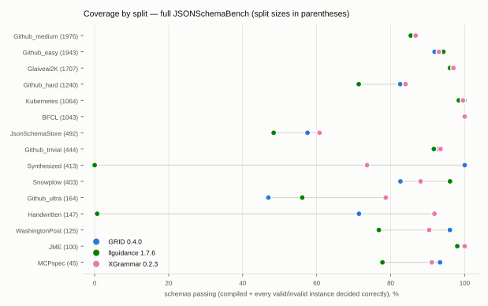
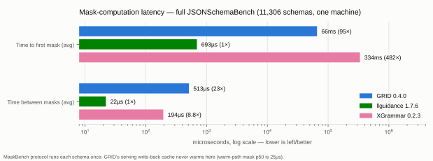

# GRID — Grammar-Railed Decoding

[](https://github.com/evolutionIdGmbH/grid/actions/workflows/ci.yml)
[](https://pypi.org/project/grid-guardrail/)
[](https://doi.org/10.5281/zenodo.21486746)
[](LICENSE)

GRID is a constrained-decoding engine for LLMs: it compiles a JSON Schema (or
any context-free grammar — SQL was first) into LALR(1) tables with constrained
terminals, and masks tokens through a configuration-keyed viable-prefix walk
served by Rust kernels. Its founding rule is that **an engine must never fail
silently**: every constraint is either *enforced* by the mask, *recorded* by
name in the result so you know exactly what to re-validate, or *declared*
unsupported up front. Nothing in between.

```bash
pip install "grid-guardrail[kernel]"   # engine + Rust mask kernels (5 platforms)
```

```python
from grid.jsonschema import compile_json_schema

source, recorded = compile_json_schema(schema)   # -> .grid grammar source
# `recorded` names every constraint present but not mask-enforced (default
# mode records; strict=True refuses instead). Nothing is silently ignored.
```

## Where GRID stands — full JSONSchemaBench, three engines, one machine

All 11,306 schemas of [JSONSchemaBench](https://github.com/guidance-ai/jsonschemabench),
every valid/invalid test instance byte-walked, engines at current versions,
identical runner semantics and tokenizer (Llama-3.1 128k). Full per-schema
statuses and protocol: [`bench/RESULTS-jsonschemabench-v0.4.0rc1.md`](bench/RESULTS-jsonschemabench-v0.4.0rc1.md).

| engine | passing | declared unsupported | valid rejected | invalid accepted | never terminates |
|---|---:|---:|---:|---:|---:|
| **GRID 0.4.0** | 10,159 (89.9%) | 637 | **3** | 876 — **every one named** | **0** |
| llguidance 1.7.6 | 9,487 (83.9%) | 1,797 | 22 | 0 | 0 |
| XGrammar 0.2.3 | 10,212 (90.3%) | 51 | 427 | 627 — **all silent** | 0 |

Three engines, three philosophies. llguidance refuses what it cannot enforce
— safe, at the cost of 16% of the corpus. XGrammar compiles almost everything
— the highest passing count, bought with the two worst failure modes: 427
schemas where **valid requests are rejected**, and 627 where invalid output
is accepted **with no indication anything was unenforced**. GRID takes the
middle contract: near-XGrammar coverage, near-llguidance safety (3
false-rejects), and when a constraint cannot be mask-enforced, the response
carries its name so downstream code re-checks exactly that.
Keyword-by-keyword status: [`grid/jsonschema/SUPPORT.md`](grid/jsonschema/SUPPORT.md);
the official JSON-Schema-Test-Suite runs in CI under that contract.

<picture>
  <source media="(prefers-color-scheme: dark)" srcset="docs/assets/coverage-by-split-dark.svg">
  
</picture>

### Latency

<picture>
  <source media="(prefers-color-scheme: dark)" srcset="docs/assets/maskbench-latency-dark.svg">
  
</picture>

Honest in both directions. llguidance's lazy lexer makes it the compile-time
(TTFM) reference point; nothing else is close and we say so. GRID's compile
average dropped 419ms -> 66ms across the 0.3/0.4 epochs (p50 7.4ms, p99
1.16s), and — unique among the three on this run — **zero schemas fail to
terminate**: every one of 11,306 compiles, declares, or budget-declines
deterministically inside the wall. Per token (TBM), GRID's warm kernel path
runs 25µs at p50 (3.7µs on SQL/CFG grammars, GRID's home turf); the average
in the chart is dominated by first-visit cold walks that the benchmark's
run-each-schema-once protocol never amortizes but a serving write-back cache
does. On redeployment, the artifact store reloads compiled schemas at
warm-hit medians of ~17-23ms for the heaviest families (measured,
load-caveated — `bench/perfbench/BAKEOFF.md`).

## What GRID has that the others are not designed for

- **The recorded-constraints contract.** Per response, the names of every
  constraint that was accepted but not mask-enforced, so downstream code
  re-validates exactly those — or strict mode, which turns them into declared
  errors, llguidance-style. Silent acceptance is not a mode GRID has.
- **Deterministic termination as a feature.** Pathological schemas cannot
  hang the compiler: construction budgets (scanner components, LALR items)
  convert would-be timeouts into declared, recorded declines in bounded time,
  with input-derived fire points that are identical on every machine and run.
- **Conflict-retry compilation.** LALR conflicts from overlapping per-branch
  string values trigger one automatic re-normalization that unifies the
  branches (recorded as widened); schemas that compile normally never execute
  the retry path.
- **A policy and audit layer underneath.** GRID began as an enterprise SQL
  guardrail: grammars are role-projected (forbidden operations unreachable
  *by construction*), every mask decision lands in a hash-chained,
  replayable audit trail, and the provably mask-unenforceable residue goes to
  checker-guided repair. JSON Schema is a front end; any context-free grammar
  in the `.grid` dialect gets the same machinery.
- **Warm redeployments.** A versioned on-disk artifact store (default off)
  reloads grammars, tables, scanners, and cross-schema terminal components,
  keyed by a code epoch that invalidates wholesale on any engine change and
  never executes a module to compute it.
- **Serving-side machinery, measured before advertised.** A jump-forward API
  (forced token runs decoded without forward passes), a tokenizer slicer for
  vocabulary-wide string masks, and an in-kernel lazy scanner (grid_core v8)
  — each behind a flag, each with a differential parity gate; the ones
  without a serving-grade measurement stay default-off and say so.
- **A measurement discipline you can audit.** `bench/perfbench/` holds the
  two-column TTFM profiler (compile-only and first-mask-included), an outcome
  classifier that refuses to count crashed or partial records as results, the
  per-candidate A/B history of every optimization that shipped (and the ones
  rejected, with reasons), and a roadmap where every deferred claim is named.
  Numbers in this README trace to committed per-schema statuses.

## SQL with policy compiled in

```python
import grid
from grid import generate, samplers
from grid.policy.bundle import PolicyBundle
from grid.policy.schema import SchemaSnapshot

model = grid.models.transformers_model.TransformersModel.from_pretrained("gpt2")
g = generate.sql(
    model,
    open("grammars/sql_subset.grid").read(),
    policy=PolicyBundle.from_store({"analyst": {"verbs": ["select"]}}, "analyst"),
    schema=SchemaSnapshot.from_dict({"users": ["id", "name", "email"]}),
    sampler=samplers.multinomial(temperature=0.7),
)
result = g("List all user names", max_tokens=64, seed=42)
```

Per-role and per-schema grammars make unauthorized verbs, tables, and columns
unreachable at decode time; the audit chain reconstructs, bit for bit, what
the model was permitted to generate at every step. Decode-time masking is
deterministic *capability reduction*; pair it with an independent check where
the SQL executes, both compiled from one policy source.

## Guarantees

Soundness, completeness, termination, and near-constant per-token cost are
stated with explicit preconditions and paired with empirical tests
(`tests/`, differential against a trial-parse oracle). See
[`DESIGN.md`](DESIGN.md) (architecture), [`GUARDRAIL-REDESIGN.md`](GUARDRAIL-REDESIGN.md)
(design rationale with proofs), [`LESSONS.md`](LESSONS.md) (the measured
history), [`ONBOARDING.md`](ONBOARDING.md) (guided tour).


## Development

```bash
python -m venv .venv && .venv/bin/pip install -e ".[dev]"
.venv/bin/pytest tests/ -q                       # verification suite
(cd grid_core && maturin develop --release)      # optional Rust kernels
.venv-bench/bin/python bench/compare_engines.py  # cross-engine SQL harness
```

Benchmark methodology and full reports live in `bench/`: pinned engine
versions, declared runners, full error distributions, no cherry-picking.

## Versions

| epoch | releases | focus |
|---|---|---|
| 0.2.x | 0.2.0-0.2.5 | correctness: JSON coverage 65% -> 89.5%, the honesty contract, official JSON-Schema-Test-Suite gate in CI |
| 0.3.x | 0.3.0 | compile-time tail: measured bake-off of 20 candidates, 7 shipped; p99 4.4s -> 1.2s |
| 0.4.x | 0.4.0 | zero timeouts, kernel v8 (in-kernel lazy product), construction budgets, conflict retry, artifact store |

## Credits

The [Outlines](https://github.com/dottxt-ai/outlines) paper started this line
of work for us in 2023; GRID's design and implementation are its own
throughout. [llguidance](https://github.com/guidance-ai/llguidance) sets the
compile-latency bar and the declare-what-you-cannot-do convention our strict
mode mirrors. [XGrammar](https://github.com/mlc-ai/xgrammar) sets the
coverage bar. [JSONSchemaBench](https://github.com/guidance-ai/jsonschemabench)
is the yardstick for all of it — it found real bugs in GRID that 95 unit
tests missed.

## License

Apache-2.0. Cite via [`CITATION.cff`](CITATION.cff)
([arXiv:2607.11951](https://arxiv.org/abs/2607.11951), artifact DOI
[10.5281/zenodo.21486746](https://doi.org/10.5281/zenodo.21486746)).
