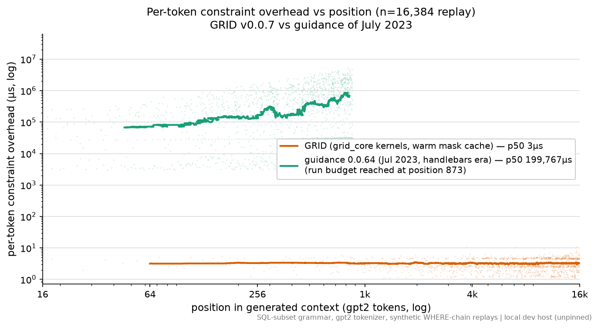
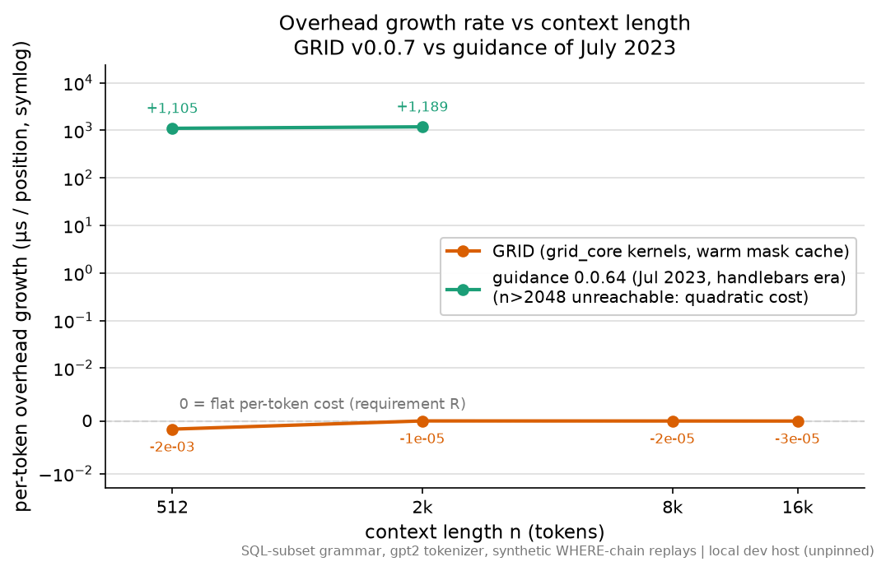

# GRID vs guidance — per-token overhead vs generated-context length (requirement R)

**Question.** Does per-token constrained-decoding overhead stay flat — i.e. does the
TOTAL guard cost stay near-linear — as the generated context grows? This is GRID's
requirement R (DESIGN.md), benchmarked here against guidance-ai/guidance in three
vintages: current (0.3.x, llguidance inside), Nov 2023 (0.1.x, the Earley rewrite),
and July 2023 (0.0.6x, the pre-CFG handlebars-template era).

Setup: SQL-subset grammar (`grammars/sql_subset.grid` and per-engine equivalents), tokenizer `gpt2`, synthetic statements whose WHERE chains extend to n ∈ {512, 2,048, 8,192, 16,384} tokens (`r_microharness.build_statement`, depth 0), 3 seeded replays per n (July-2023 arm: 2 seeds, largest n capped by a per-run wall budget), token-stream replay with no neural model in the loop (the July-2023 arm generates rather than replays — see its notes). Host: local dev Mac (unpinned).

Charts show the headline pair only — GRID v0.0.7 vs guidance of July 2023 (the era the v0.0.5 design was conceived against); the tables below carry all four arms. First chart: per-token constraint overhead vs position at n=16,384 (log–log; lines are rolling medians over the per-step scatter). Second chart: OLS slope of overhead vs position at each n (0 = flat = requirement R).

## Engines and measured windows

- **GRID** (this repo, `grid_core` 0.1.0; Rust kernels active: **True**). Two-pass replay exactly as `bench/r_microharness.py`: pass 1 populates the mask cache, pass 2 (warm) times `guide._mask_ids(state)` per position — that is the guard cost. `get_next_state` (advance) timed separately: p50 7.6 µs, also flat (combined slope in the JSON).
- **guidance 0.3.1** (current; llguidance 1.5.0 inside). The SQL grammar is built in guidance's own DSL (recursive `@guidance(stateless=True)` functions + `select`/`regex`), serialized by guidance to lark, and driven through guidance's low-level per-token machinery: `TokenParser(...)` (backtrack/fast-forward disabled) owning an `llguidance.LLInterpreter`. Timed per position: `compute_mask()` (returns the token bitmask + progress JSON — what guidance waits on each step); `commit_token()` timed separately. Single timed pass per replay: llguidance keeps no cross-run mask cache, so within-run steady state IS its warm state (first 32 positions excluded from slope fits).
- **guidance 0.1.5** (released 2023-11-29 — the Nov-2023 vintage; pure-Python `EarleyCommitParser` + token-trie mask walk). The same SQL subset built as a byte-level recursive CFG in the era's own grammar API (`Select`/`Join`/`Byte`/`ByteRange`, `Placeholder` recursion). Driven through the real engine loop (`Model.__call__`) on a gpt2-vocab `Model` subclass whose logits steer temperature-0 sampling along the statement. Timed per engine step: full step wall time minus the instrumented `_get_logits` call and minus `np.argsort` (sampling). What remains is the era's constraint machinery: forced-byte trie walk, per-byte Earley advances (`next_byte_mask` + `consume_byte`), token validation and tokenization cleanup. Engine steps are denser than gpt2 tokens (greedy trie tokenization); positions are normalized to gpt2-token equivalents by bytes and the per-gpt2-token cost column applies the step ratio.
- **guidance 0.0.64** (guidance==0.0.64 (PyPI, uploaded 2023-06-21; the artifact `pip install guidance` served throughout early July 2023 — no release between it and 0.1.0 on 2023-11-14)) — the July-2023 handlebars-template era, pre-CFG. There is no grammar engine to feed the SQL grammar to, so the closest structured equivalent grows the same WHERE-chain shape: a `{{#geneach}}` loop of `{{gen pattern="c[0-9]{1,3} (=|<|>|<=|>=|<>) [0-9]{1,5}"}}` predicates joined by non-block `{{select options=[' and',' or']}}` connectors (block-mode `{{#select}}` leaks option text into the output on this release in script mode, so the non-block form is used). The LLM is `guidance.llms.Transformers` (token healing ON, acceleration ON, disk cache OFF) wrapping a tiny random-weight GPT2 (1 layer, d=64, `n_positions=32768`) so the context can grow past real-gpt2's 1024-position limit; generation content is pattern-valid but model-arbitrary — only the SHAPE and length matter here. Timed per token: the gap between consecutive instrumented `model.forward()` calls — i.e. everything guidance does between model steps (template executor, full-prompt re-encode per op, token-healing setup, `RegexLogitsProcessor`/`RegexStoppingCriteria` full-string rebuilds per token, `select`'s full-prefix re-tokenization per option). Forward time excluded. First 32 positions excluded from fits.

## Results

| engine | n | steps | p50 | p90 | p99 | slope (µs/pos) | cum. R² | 1st-half p50 → 2nd-half p50 |
|---|---|---|---|---|---|---|---|---|
| GRID (grid_core kernels, warm mask cache) | 512 | 1,536 | 3.0 µs | 4.6 µs | 11.2 µs | -0.001566 | 0.99812 | 3.1 → 2.9 µs |
| GRID (grid_core kernels, warm mask cache) | 2,048 | 6,144 | 3.0 µs | 4.6 µs | 9.2 µs | -0.000010 | 0.99985 | 3.1 → 3.1 µs |
| GRID (grid_core kernels, warm mask cache) | 8,192 | 24,576 | 3.2 µs | 4.8 µs | 6.0 µs | -0.000022 | 0.99980 | 3.2 → 3.2 µs |
| GRID (grid_core kernels, warm mask cache) | 16,384 | 49,152 | 3.2 µs | 4.8 µs | 7.6 µs | -0.000033 | 0.99767 | 3.2 → 3.2 µs |
| guidance 0.3.1 (llguidance LLInterpreter) | 512 | 2,560 | 97.3 µs | 232.9 µs | 242.8 µs | -0.001636 | 0.99991 | 97.7 → 97.1 µs |
| guidance 0.3.1 (llguidance LLInterpreter) | 2,048 | 10,240 | 97.2 µs | 233.2 µs | 240.6 µs | -0.000320 | 0.99998 | 97.3 → 97.1 µs |
| guidance 0.3.1 (llguidance LLInterpreter) | 8,192 | 40,960 | 97.7 µs | 234.7 µs | 241.5 µs | -0.000101 | 0.99999 | 97.6 → 97.9 µs |
| guidance 0.3.1 (llguidance LLInterpreter) | 16,384 | 81,920 | 97.7 µs | 234.2 µs | 240.9 µs | +0.000015 | 0.99999 | 97.5 → 97.9 µs |
| guidance 0.1.5 (Nov 2023, Python Earley) | 512 | 2,546 | 114.4 µs | 181.9 µs | 264.9 µs | +0.003382 | 0.99995 | 113.8 → 116.1 µs |
| guidance 0.1.5 (Nov 2023, Python Earley) | 2,048 | 10,201 | 114.5 µs | 179.7 µs | 290.8 µs | +0.047273 | 0.96773 | 114.6 → 114.7 µs |
| guidance 0.1.5 (Nov 2023, Python Earley) | 8,192 | 40,829 | 113.5 µs | 180.2 µs | 303.1 µs | -0.000922 | 0.99735 | 113.2 → 113.8 µs |
| guidance 0.1.5 (Nov 2023, Python Earley) | 16,384 | 81,646 | 114.1 µs | 181.0 µs | 298.2 µs | -0.000568 | 0.99846 | 113.5 → 114.6 µs |
| guidance 0.0.64 (Jul 2023, handlebars era) | 512 | 1,764 | 122,649.4 µs | 974,008.4 µs | 1,944,567.4 µs | +1105.480818 | 0.95369 | 79,770.9 → 196,693.4 µs |
| guidance 0.0.64 (Jul 2023, handlebars era) | 2,048 | 1,636 | 199,767.4 µs | 1,642,171.9 µs | 3,462,274.9 µs | +1188.603724 | 0.94428 | 122,410.7 → 437,009.5 µs (budget-truncated) |

Slope-column notes (the three replay arms — GRID, 0.3.1, 0.1.5): n=512 fits carry a small bias of either sign — a handful of early positions pay one-off warm-in costs, which dominates a 512-step fit; at n ≥ 8,192 those fits converge to |slope| < 1e-3 µs/pos. The July-2023 arm's large positive slopes are NOT bias — they are the era's real per-token growth (see verdict). The 0.1.5 outlier at n=2,048 (+0.047 µs/pos, R² 0.968, consistent across all 5 seeds) is the GC transition: the first gen-2 collections land in the second half of a ~2k-token generation; at larger n the stalls distribute and the fit flattens again — see the tail table below.

### Tail behavior across one n=16,384 generation (seed-0 series, per quarter)

| engine | Q | p50 | p99.9 | max single step | mean |
|---|---|---|---|---|---|
| GRID (grid_core kernels, warm mask cache) | Q1 | 3.2 µs | 8.9 µs | 0.02 ms | 3.2 µs |
| GRID (grid_core kernels, warm mask cache) | Q2 | 3.2 µs | 8.9 µs | 0.01 ms | 3.1 µs |
| GRID (grid_core kernels, warm mask cache) | Q3 | 3.2 µs | 9.4 µs | 0.01 ms | 3.2 µs |
| GRID (grid_core kernels, warm mask cache) | Q4 | 3.2 µs | 9.5 µs | 0.03 ms | 3.2 µs |
| guidance 0.3.1 (llguidance LLInterpreter) | Q1 | 96.7 µs | 269.4 µs | 0.27 ms | 114.3 µs |
| guidance 0.3.1 (llguidance LLInterpreter) | Q2 | 97.3 µs | 255.9 µs | 0.31 ms | 114.3 µs |
| guidance 0.3.1 (llguidance LLInterpreter) | Q3 | 98.1 µs | 257.3 µs | 0.28 ms | 114.6 µs |
| guidance 0.3.1 (llguidance LLInterpreter) | Q4 | 98.4 µs | 263.1 µs | 0.32 ms | 114.6 µs |
| guidance 0.1.5 (Nov 2023, Python Earley) | Q1 | 112.5 µs | 569.2 µs | 67.54 ms | 159.6 µs |
| guidance 0.1.5 (Nov 2023, Python Earley) | Q2 | 113.2 µs | 514.2 µs | 78.51 ms | 148.5 µs |
| guidance 0.1.5 (Nov 2023, Python Earley) | Q3 | 113.5 µs | 506.5 µs | 91.05 ms | 152.2 µs |
| guidance 0.1.5 (Nov 2023, Python Earley) | Q4 | 114.5 µs | 541.8 µs | 106.22 ms | 156.6 µs |
| guidance 0.0.64 (Jul 2023, handlebars era) — to 873 tok | Q1 | 90,814.0 µs | 1,350,081.6 µs | 1,382.93 ms | 174,770.3 µs |
| guidance 0.0.64 (Jul 2023, handlebars era) — to 873 tok | Q2 | 172,592.6 µs | 2,429,972.3 µs | 2,468.01 ms | 404,527.3 µs |
| guidance 0.0.64 (Jul 2023, handlebars era) — to 873 tok | Q3 | 351,990.5 µs | 3,594,703.6 µs | 3,626.56 ms | 668,167.9 µs |
| guidance 0.0.64 (Jul 2023, handlebars era) — to 873 tok | Q4 | 592,612.6 µs | 5,070,848.4 µs | 5,233.31 ms | 949,317.1 µs |

Total constraint cost over the seed-0 replay at n=16,384: **GRID (grid_core kernels, warm mask cache): 0.05 s**; **guidance 0.3.1 (llguidance LLInterpreter): 1.88 s**; **guidance 0.1.5 (Nov 2023, Python Earley): 2.52 s**; **guidance 0.0.64 (Jul 2023, handlebars era): 898.48 s** (measured span 0–873 tok).

## Verdict

- **GRID: requirement R holds.** Warm guard cost is flat at every n (p50 3.2 µs at n=16,384, slope -0.000033 µs/pos ≈ 0, cumulative-cost R² ≥ 0.99767): total guard cost is linear in generated length. Numbers come from the kernel-active path (`guide.producer._kernel is not None` = True).
- **guidance 0.3.1 (current): also flat** — as expected, since its grammar engine is llguidance's Rust core (slope +0.000015 µs/pos at n=16,384) — at a ~30× higher per-token constant (mask p50 97.7 µs vs GRID's 3.2 µs on identical replays), with a bounded tail.
- **guidance 0.1.5 (Nov 2023): flat median, growing stalls.** Median per-step constraint cost is position-independent (slope -0.000568 µs/pos at n=16,384; per-step p50 114.1 µs, ×1.00 engine steps per gpt2 token ≈ 114 µs per token position, ~35× GRID). The tail is the scaling story: the largest single step grows 68 ms → 106 ms from the first to the last quarter of one generation — CPython gen-2 GC pauses that scan the live Earley chart, whose size grows with the generated context (verified with gc.callbacks: every >5 ms step coincides with a gen-2 collection, and pause duration tracks chart size). Median cost is flat; worst-case per-token cost grows linearly with context, and cumulative cost bows accordingly (R² 0.99846 vs GRID's 0.99767).
- **guidance 0.0.64 (July 2023, handlebars era): requirement R does NOT hold — per-token overhead grows linearly with context.** Measured overhead-vs-position slopes: n=512: +1,105.5 µs/pos; n=2,048: +1,188.6 µs/pos (vs ≈0 for every other arm; cumulative cost is visibly quadratic, R² 0.944). Fitted per-token cost at the largest measured n (2,048): 27.03 ms + 1,188.6 µs/pos. The mechanism is in the era's own code: `RegexLogitsProcessor.__call__` rebuilds the full accumulated string per candidate token (`str(current_strings)[prefix:]`), `RegexStoppingCriteria` does another full-string rebuild per token, and every `gen`/`select` op re-encodes the entire prompt (select even re-tokenizes the prefix once per option — their own code comments flag it). **Extrapolation (explicitly labeled — not measured):** holding the linear fit, per-token overhead at position 16,384 would be ≈19,501 ms and total constraint cost ≈11.1 h at n=8,192 / ≈44.4 h at n=16,384 — which is why the larger n were not run to completion (per-run budget).

## Caveats (read before quoting)

- Unpinned local host (Apple Silicon macOS, otherwise idle); absolute numbers are indicative, slopes/shape are the claim. Wall-clock timers (`time.perf_counter`).
- `gc.collect()` runs between replays in every arm so one run's garbage cannot leak into the next run's timings; GC activity *during* a replay is deliberately kept — it is part of engine cost (the 0.1.x stalls are exactly that).
- GRID's headline is the warm second pass, per the flat-per-token-cost protocol: cold misses are paid once per first-seen grammar configuration on pass 1 (hit rate and miss p99 recorded in the JSON; see bench/RESULTS-r.md). The guidance arms are single-pass because llguidance and the 2023 Earley engine have no cross-run mask cache to warm — their steady state is within-run.
- guidance-current window includes llguidance's progress-JSON serialization (guidance's own `TokenParser.compute_mask` additionally pydantic-validates that JSON; excluded here). `commit_token` (~1 µs p50) is timed separately and its inclusion does not change the slope verdict (combined slope in JSON).
- In real serving guidance overlaps `compute_mask` with the model's forward pass (worker thread); we measure the raw constraint cost, not its hidability.
- The 2023 arm uses a synthetic logits provider (no NN, like guidance's own `models.Mock`) so the engine's constraint machinery is isolated; `_get_logits` and `np.argsort` (sampling) are measured per call and subtracted from every step. It excludes guidance-0.1.x's per-token `Model.copy()`/state-append overhead in `_run_stateless` (user-facing cost, grows with state size) — i.e. the measurement is conservative in guidance's favor.
- Grammar parity: GRID uses its lexer grammar (`%ignore` WS, maximal munch); the guidance arms use explicit-whitespace encodings (lark / byte-level CFG). Same language on these statements; the byte-level 2023 encoding keeps boundary hypotheses alive in the Earley chart, which is inherent to how 0.1.x represented grammars.
- guidance 0.1.5 tokenizes along its token trie (greedy longest-match with forced-byte healing), so its engine-step count exceeds the gpt2 token count by the reported ratio; positions are byte-normalized for comparability.
- July-2023 artifact selection: no PyPI release lands inside 2023-07-01..15 (0.0.64 is 2023-06-21, then nothing until 0.1.0 on 2023-11-14), and installing from a git SHA (93bf3e0be99ed535bee4bf0f8a6379d23e73b8eb, 2023-07-06) was blocked by this environment's install policy for unvetted git sources — so the arm runs PyPI `guidance==0.0.64`, which is bit-for-bit what `pip install guidance` served throughout early July 2023.
- The July-2023 window includes asyncio/template-executor time between model calls (that is the product's real engine path); it excludes one-time setup (token-prefix map build) and the model forward. The era's default per-call disk cache (`caching=True`, diskcache/sqlite writes of the full prompt) is disabled — another conservative choice in guidance's favor. Its generation content is pattern-valid but model-arbitrary (tiny random-weight GPT2); only the shape/length of the WHERE chain is controlled, which is what the scaling question needs.
- July-2023 runs stop at the largest n that completes within the per-run budget (--budget-s); larger-n figures in the verdict are linear-fit extrapolations and are labeled as such.

## Environment

- `grid`: python 3.12.12, llguidance 1.7.6, transformers 5.13.0, torch 2.12.1, numpy 2.5.1, grid_core 0.1.0 (macOS-26.5.2-arm64-arm-64bit)
- `guidance`: python 3.12.12, guidance 0.3.1, llguidance 1.5.0, transformers 5.13.0, torch 2.12.1, numpy 2.5.1 (macOS-26.5.2-arm64-arm-64bit)
- `guidance-2023`: python 3.11.11, guidance 0.1.5, transformers 4.35.2, torch 2.1.2, numpy 1.26.4 (macOS-26.5.2-arm64-arm-64bit)
- `guidance-2023-07`: python 3.10.18, guidance 0.0.64, transformers 4.30.2, torch 2.0.1, numpy 1.26.4 (macOS-26.5.2-arm64-arm-64bit)

Harness: `bench/guidance_scaling.py` (this file documents the exact timed windows; JSON per arm in the data dir).
